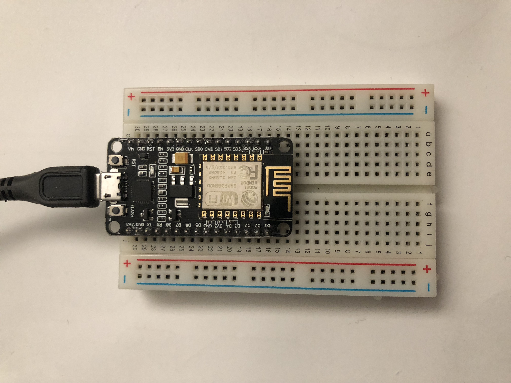

# ESP8266-temperatureSensor

Tested On macOS High Sierra

## Init your ESP8266

[Datasheet ESP8266](https://cdn-learn.adafruit.com/assets/assets/000/046/211/original/Huzzah_ESP8266_Pinout_v1.2.pdf?1504807178)

* Requirement
    * Download micropython [esp8266-20171101-v1.9.3.bin](https://micropython.org/download)
    * Download SLAB_USBtoUART driver [USB to UART Bridge Virtual COM Port (VCP)](https://www.silabs.com/products/development-tools/software/usb-to-uart-bridge-vcp-drivers)
    * Clone github repo [themadinventor/sptool](https://github.com/themadinventor/esptool)
    * Clone github repo [micropython/webrepl](https://github.com/micropython/webrepl)
    * brew install picocom
    * pip install esptool

Plug USB to ESP8266




```
$ python3 esptool.py --port /dev/cu.SLAB_USBtoUART erase_flash
esptool.py v2.2
Connecting........_
Detecting chip type... ESP8266
Chip is ESP8266EX
Uploading stub...
Running stub...
Stub running...
Erasing flash (this may take a while)...
Chip erase completed successfully in 7.9s
Hard resetting...

```
```
$ python3 esptool.py --port /dev/cu.SLAB_USBtoUART write_flash --flash_size=detect 0 esp8266-20171101-v1.9.3.bin
esptool.py v2.2
Connecting........_
Detecting chip type... ESP8266
Chip is ESP8266EX
Uploading stub...
Running stub...
Stub running...
Configuring flash size...
Auto-detected Flash size: 4MB
Flash params set to 0x0040
Compressed 600888 bytes to 392073...
Wrote 600888 bytes (392073 compressed) at 0x00000000 in 34.6 seconds (effective 138.7 kbit/s)...
Hash of data verified.

Leaving...
Hard resetting...
```

ESP8266 restarts automatically after flash

You must see your device appear in your wifi ! (default password is **micropythoN**)

Try to connect


## Setup your ESP8266

For the first configuration, it is necessary to connect via USB


```
$ picocom /dev/cu.SLAB_USBtoUART -b115200
picocom v3.1

port is        : /dev/cu.SLAB_USBtoUART
flowcontrol    : none
baudrate is    : 115200
parity is      : none
databits are   : 8
stopbits are   : 1
escape is      : C-a
local echo is  : no
noinit is      : no
noreset is     : no
hangup is      : no
nolock is      : no
send_cmd is    : sz -vv
receive_cmd is : rz -vv -E
imap is        :
omap is        :
emap is        : crcrlf,delbs,
logfile is     : none
initstring     : none
exit_after is  : not set
exit is        : no

Type [C-a] [C-h] to see available commands
Terminal ready

>>> import webrepl_setup
WebREPL daemon auto-start status: disabled

Would you like to (E)nable or (D)isable it running on boot?
(Empty line to quit)
> E
To enable WebREPL, you must set password for it
New password (4-9 chars): Ohx1ThaoJ
Confirm password: Ohx1ThaoJ
Changes will be activated after reboot
Would you like to reboot now? (y/n) y

```

ESP8266 restarts automatically after setup

Now you can access the device via web socket (WebREPL daemon started on ws://192.168.4.1:8266)
## Assembly

[Datasheet ESP8266](https://cdn-learn.adafruit.com/assets/assets/000/046/211/original/Huzzah_ESP8266_Pinout_v1.2.pdf?1504807178)

DS18B20 DATA : PIN 4

DS18B20 GND (-) : GND

DS18B20 3.3v (+) : 3.3v

RESET : RST TO PIN 16


## Upload code

You must be connect to micropython wifi

### Ui method

Use `webrepl.html` file in micropython/webrepl repo


### Command line method

Use `webrepl_cli.py` file in micropython/webrepl repo

```
$ ./webrepl_cli.py -p Ohx1ThaoJ ~/mygit/ESP8266-temperatureSensor/DS18B20/main.py 192.168.4.1:/
op:put, host:192.168.4.1, port:8266, passwd:Ohx1ThaoJ.
/Users/clement/mygit/ESP8266-temperatureSensor/DS18B20/main.py -> /main.py
Remote WebREPL version: (1, 9, 3)
Sent 2836 of 2836 bytes
```

**Be careful** the code here contains a sleep, n this case the wifi sometimes in standby. It will have to be taken into account during the test.

Tips: Log in via picocom (USB) and interrupt the program via ctrl+C.

## Grafana

You can add a grafana dashboard to view the data


## Helping

```
Control commands:
  CTRL-A        -- on a blank line, enter raw REPL mode
  CTRL-B        -- on a blank line, enter normal REPL mode
  CTRL-C        -- interrupt a running program
  CTRL-D        -- on a blank line, do a soft reset of the board
  CTRL-E        -- on a blank line, enter paste mode

For further help on a specific object, type help(obj)
```

### Manage files

```
>>> import os
>>> os.remove('main.1.py')
>>> os.listdir()
['boot.py', 'webrepl_cfg.py', 'main.py']
>>>

```
